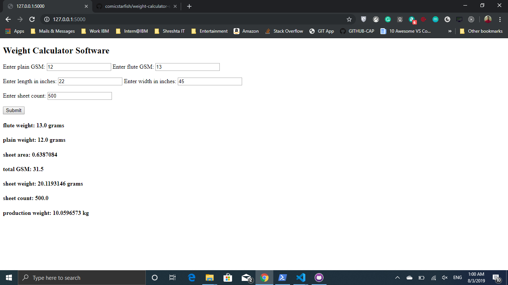

## Weight Calculator Software
### 1. Clone this git repo.

### 2. Go to CMD and run the following:
```
C:\Users\ganesh>pip3 install flask
...

C:\Users\manoj>pip3 install wtforms
...
```
### 3. Now goto (cd into) the cloned directory:
```
C:\Users\ganesh>cd .\Downloads\weight-calculator-software\
```
### 4. Run the python script
```
C:\Users\ganesh\Downloads\weight-calculator-software> python3 app.py
```
NOTE: If this fails try `python app.py`
### 5. At this point your CMD should display something like this:
```
* Serving Flask app "app" (lazy loading)
* Environment: production   WARNING: This is a development server. Do not use it in a production deployment. Use a production WSGI server instead. 
* Debug mode: on
* Restarting with stat
* Debugger is active!
* Debugger PIN: 557-577-282
* Running on http://127.0.0.1:5000/ (Press CTRL+C to quit)
...
```
### 6. Hold Ctrl and click the displayed link to access the python web app, or simply copy paste `http://127.0.0.1:5000` in web browser.

